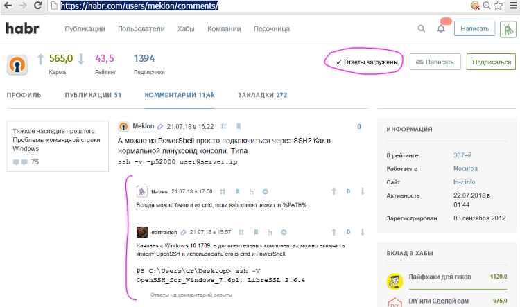

# HabraReply 

English description goes below.

Браузерное расширение для Chrome (>= 46.0) и FF (>= 45.0) для показа ответов на комментарии в профиле пользователя на Хабрахабре. Под каждым комментарием оно подгружает ответы на него.

Демо:

## Зачем?

Если вы оставили где-то в статье комментарий, а кто-то на него ответил или задал вам вопрос, то единственный способ узнать о нем - зайти в свою почту и найти там уведомление. Но сейчас у многих почтовые ящики и так переполнены уведомлениями от соцсетей, и найти там уведомление непросто. Плюс, если у вас много почтовых ящиков, то заходить в нужный только ради комментариев неудобно. 

Расширение решает эту проблему, загружая ответы на комментарии в вашем профиле или профиле любого пользователя. Работает, даже если вы не залогинены на Хабре. 

Расширение не использует фоновую страницу, а лишь контентные скрипты, и выполняется (тратит память и CPU), только если вы зайдете в чей-то профиль на Хабре.

Расширение **не содержит** трекеров или аналитики и не следит за вами. Где вы еще такое найдете?

## Установка

Скачайте или клонируйте папку с расширением с гитхаба к себе на диск.

Chrome: откройте страницу <chrome://extensions>, включите режим разработчика и нажмите на кнопку "Загрузить распакованное расширение". Выберите папку расширения. 

*Мы не публикуем расширение в Chrome Web Store, так как это требует передачи персональных данных в Google и [платы за регистрацию](https://developer.chrome.com/webstore/publish#pay-the-developer-signup-fee) developer account. Устанавливать расширения из Web Store в любом случае не лучшая идея, так как они могут содержать скрытый или вредоносный функционал*.

Firefox: откройте страницу <about:debugging>, вкладку addons и нажмите кнопку "Load Temporary Add-on". Выберите путь к файлу manifest.json расширения на диске. Это установит расширение временно, до завершения Firefox.

## Недостатки

Расширение сделано максимально быстро и больше напоминает наспех написанный скрипт, чем качественный продукт.

Так как публичного API для получения ответов на комментарии нет, расширению приходится загружать HTML-страницы постов (весят до 2-3 Мб каждая) и парсить HTML в них. Подгрузка ответов на одной странице может занять до 30-40 секунд и потребляет до 200-300 Мб ОЗУ.

Это можно было бы исправить загрузкой мобильных страниц комментариев (они легче), но мне некогда было этим заняться. Pull-реквесты с исправлениями с радостью принимаются.

## Известные проблемы

- работает очень медленно и потребляет очень много ОЗУ
- если происходит ошибка, то сообщение о ней на кнопке показывается до того, как загрузка завершится полностью
- если происходит ошибка, то кеш DOM-деревьев страниц может быть не очищен и вкладка продолжит потреблять большое количество памяти

## Сборка для Firefox

Для сборки нужно установить Node.JS, утилиту [web-ext](https://github.com/mozilla/web-ext) и выполнить команду `web-ext build` в директории с расширением.

## Тестирование

Для проверки расширения необходимо установить Node.JS, утилиту [addons-linter](https://github.com/mozilla/addons-linter) и выполнить команду `addons-linter .` в директории с расширением.

## English description

HabraReply is an extension to load and display replies for comments on Habr.com user's profile page.

To build an extension, install [web-ext](https://github.com/mozilla/web-ext) and run `web-ext build` in the extension directory.
